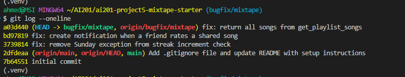

# Mixtape

## Milestone 4: AI Usage

I used Claude Code as a research and sanity-check tool, not to write the fixes for me. I did my own reading of the code and my own diagnosis for each bug; I used AI mainly to speed up navigation and to double-check my hypotheses before committing to a fix.

- **Orientation:** Asked it to summarize each service file and trace one data flow (adding a song to a playlist) to cross-check my own reading before writing the codebase map.
- **Reproduction:** Used it to script an isolated call to `update_listening_streak()` with controlled Saturday/Sunday/Monday timestamps for Issue #1, since I couldn't wait for a real Sunday, and to script `curl` checks against the live server for #4 and #5.
- **Root cause:** Once I'd narrowed each bug to a specific function, I had it read that function alongside its docstring to confirm the mismatch I'd already spotted, and for Issue #4, to line up `add_to_playlist()` against `rate_song()` so I could see exactly which block was missing.
- **Verification:** After each fix, I had it check both sides of the relevant boundary (Sunday vs. Monday, self vs. friend, 1-song vs. 7-song) and re-run the test suite for regressions.
- **Commit cleanup:** My first three commits used `Fix ...` instead of the required `fix: ...` conventional-commit prefix and were already pushed. I had it reword all three (cherry-pick onto the prior commit) and confirmed the resulting tree was byte-identical to the original via `git diff` before force-pushing.

## Milestone 1: Codebase Map

### Main files and what they do

- **app.py**: Flask app factory (`create_app`). Sets up the SQLAlchemy `db` instance, configures the database URI, registers the four blueprints (`songs`, `playlists`, `users`, `feed`), and calls `db.create_all()` on startup. This is the only place the blueprints get wired up.

- **models.py**: All the SQLAlchemy models: `User`, `Tag`, `Song`, `ListeningEvent`, `Rating`, `Playlist`, `Notification`. A few things worth calling out:
  - `friendships` is a self-referential many-to-many table on `User`.
  - `song_tags` is a plain many-to-many between `Song` and `Tag`.
  - `playlist_entries` is the join table between `Playlist` and `Song`, but it's not a bare join table, it also carries `position`, `added_by`, and `added_at`. So playlist ordering is driven by a `position` integer, not insertion order.
  - Every model has a `to_dict()`, that's what routes serialize directly to JSON.

- **routes/**: Thin controllers. Every route function: pulls request data, does basic presence validation (400 if a required field is missing), calls exactly one service function, and turns the result (or a `ValueError`) into a JSON response. There's essentially zero business logic in this layer.
  - `songs.py`: search, get one song, rate a song, log a listen.
  - `playlists.py`: create playlist, get playlist metadata, get playlist's songs, add a song to a playlist.
  - `users.py`: get user, get streak, get/mark notifications.
  - `feed.py`: friends-listening-now, activity feed.

- **services/**: All business logic lives here, one file per feature area:
  - `streak_service.py`: updates a user's `listening_streak` when they log a listen.
  - `feed_service.py`: friends-listening-now (last 24h) and general activity feed (last N events, no time filter).
  - `search_service.py`: title/artist search over songs.
  - `notification_service.py`: creates notifications and also does two things that aren't obviously "notification" work: adding a song to a playlist (`add_to_playlist`) and rating a song (`rate_song`). Both live here because both need to create a notification as a side effect.
  - `playlist_service.py`: playlist CRUD-ish reads (create, get metadata, get songs in order, get a user's playlists).

- **seed_data.py**: Wipes and recreates the DB, then inserts 5 users with a friendship graph, 10 tags, 25 songs, a few playlists, and listening events spread over the last two weeks. Worth noting it seeds users with pre-existing `listening_streak` values and recent listening events.

- **tests/**: `test_streaks.py`, `test_search.py`, `test_playlists.py`. Existing coverage, presumably a starting point I can extend with a regression test.

### Pattern I noticed

Routes never touch models or the DB session directly except in `users.py`'s `get_user`, which reads `User` directly instead of going through a service. Otherwise the rule holds everywhere: **route = parse input + call one service + format output**, **service = all business logic + all DB writes**. That means when something is wrong behavior-wise, the routes are basically never the cause, I should always end up in `services/`.

The other pattern: notification side effects are attached directly inside the action that triggers them (e.g., `add_to_playlist` creates the playlist-add notification as its last step, inline in the same function) rather than through a shared "fire this event" helper.

### Data flow: adding a song to a playlist (with notification)

1. `POST /playlists/<playlist_id>/songs` hits `add_song()` in `routes/playlists.py`.
2. The route pulls `song_id` and `added_by` out of the JSON body, checks both are present (400 if not), and calls `notification_service.add_to_playlist(playlist_id, song_id, added_by)`.
3. Inside `add_to_playlist`:
   - Looks up the `Song`, the adding `User`, and the `Playlist`, raises `ValueError` (400 at the route) if any is missing.
   - If the song isn't already in `playlist.songs`, appends it (via the `songs` relationship, which writes into `playlist_entries`) and commits.
   - If the person adding the song isn't the original sharer of the song, calls `create_notification()` to notify the original sharer, with a body like `"{adder} added your song '{title}' to the playlist '{name}'."`
4. `create_notification()` (also in `notification_service.py`) just builds a `Notification` row and commits it.
5. The route returns `{"message": "Song added to playlist"}, 201`. The notification itself is only ever surfaced later, when the recipient calls `GET /users/<user_id>/notifications`, which goes through `get_notifications()` then queries `Notification` filtered by `user_id` (and `read=False` if `unread_only`), ordered newest-first.

So "sharing triggers a notification" isn't really a single push, it's a DB row that gets picked up on the next poll of the notifications endpoint. Same infrastructure (`create_notification`) is meant to back every notification type; it's just a matter of who remembers to call it.

## Milestone 2: Steps for Reproducing the Three Chosen Bugs

I'm focusing on Issues #1, #4, and #5 for my three required fixes. Before touching any code, I reproduced each one against a freshly seeded DB (`python seed_data.py`) and the live dev server (`FLASK_APP=app:create_app flask run`), confirming the reported behavior actually happens.

### Issue #1: Listening streak keeps resetting

**How I reproduced it:** This one only triggers under a specific date condition (the day the listen lands on has to be a Sunday), and the real calendar date I'm working on isn't a Sunday, so hitting it through the actual HTTP flow (`POST /songs/<id>/listen`) would mean waiting for an actual Sunday. Instead I isolated `update_listening_streak()` directly in a script (per the "isolate the function" strategy) and controlled the `now` argument myself:

- Built a fake user object with `listening_streak = 5` and `last_listened_at` set to a Saturday.
- Called `update_listening_streak(user, now)` with `now` set to the very next day, a Sunday, which is exactly one calendar day later. That's the "listened yesterday, listen again today" case, which per the docstring should just increment the streak by 1.
- Result: the streak went from 5 to **1**, not 6.
- As a control, I reran the identical one-day-gap scenario but shifted so the second listen landed on a Monday instead of a Sunday: streak went from 5 to 6, exactly as expected.

So the condition that triggers it is precisely: a user's *n*th consecutive daily listen happens to fall on a Sunday. Every other day of the week, the same gap increments normally, which points at a day-of-week check inside `update_listening_streak()` in `streak_service.py` treating Sunday as a special case when it shouldn't be.

### Issue #4: No notification when a friend rates my song

**How I reproduced it:** I hit the actual API end to end since there's no unusual timing/state condition here, just a sequence of actions:

1. `GET /users/<nova_id>/notifications` first, to get a baseline, 1 existing notification.
2. `POST /songs/<song_id>/rate` for a song nova shared ("Midnight Drive"), submitting the rating as darius (a different user, so the "not-self" notification condition should apply) with `{"user_id": darius_id, "score": 5}`.
3. Got back a `201` with a valid rating object, so the rating itself saved correctly, the write path isn't broken.
4. `GET /users/<nova_id>/notifications` again, still exactly 1 notification, the same old playlist-add one. Nothing new was created for the rating.

The trigger condition is just: any user other than the sharer rates a song, no boundary or timing state involved. It fails every single time, not intermittently, which tells me this isn't a comparison-logic bug like #1, it's something missing outright, likely a call to `create_notification()` that `rate_song()` never makes.

### Issue #5: Last song in a playlist never shows up

**How I reproduced it:** I confirmed the actual DB state first by querying the `playlist_entries` table directly, so I knew ahead of time what the correct answer should be, "Late Night Vibes" has 7 entries at positions 1 through 7, with "Free Throws" at position 7. Then I called `GET /playlists/<playlist_id>/songs` and compared.

- Expected: 7 songs back, ending with "Free Throws".
- Actual: `count: 6`, and the response cuts off after position 6 ("Golden Hour"), "Free Throws" is missing entirely, not just re-ordered or malformed.

I checked this against all three seeded playlists (each has exactly 7 entries) and in every case the response was missing exactly one song, the one at the highest position number. So the condition here isn't really conditional at all: it happens on every playlist, every time, regardless of song count or position values. It's a systematic off-by-one in `get_playlist_songs()` in `playlist_service.py`, not something tied to specific data.

## Milestone 3: Root Cause Analysis for the Three Chosen Bugs

### Issue #1: Listening streak keeps resetting

**How I reproduced it:** See the Milestone 2 entry above, I isolated `update_listening_streak()` with a controlled Saturday-to-Sunday consecutive-day listen and got a reset to 1 instead of an increment to 6, plus a Monday control case that worked correctly.

**How I found the root cause:** I only had to look at one file, `services/streak_service.py`. The docstring on `update_listening_streak()` spells out the rules in plain language: same day = no change, exactly one day gap = increment, more than one day = reset. Reading straight down the function, the `if/elif/else` block matches that structure almost exactly, except the `elif` branch has an extra clause tacked on: `elif days_since_last == 1 and today.weekday() != 6:`. That clause isn't mentioned anywhere in the docstring's rules, which was the moment I was confident I'd found it, not just a suspicious area, but a condition that directly contradicts the documented behavior. I confirmed `weekday()` returns 6 for Sunday (0 = Monday) to be sure I had the right day.

**The root cause:** Python's `datetime.weekday()` returns `6` for Sunday. The streak-increment branch was written as `days_since_last == 1 and today.weekday() != 6`, so whenever a consecutive-day listen happened to land on a Sunday, the `!= 6` check evaluated to `False`, the `elif` failed, and execution fell through to the `else` branch, which unconditionally resets the streak to 1. So a user with a 7-day streak who listens again the very next day loses their whole streak if that next day happens to be a Sunday, an otherwise completely normal, gap-free listen gets treated as if they'd skipped a week.

**My fix and side-effect check:** I removed the `and today.weekday() != 6` clause, so the branch is just `elif days_since_last == 1:`, matching the docstring's actual rule with no day-of-week exception. After the fix I re-ran my Saturday→Sunday repro (now correctly increments 5->6) and a Sunda to Monday control (still correctly increments, confirming I didn't just shift the bug to a different day). I also checked the same-day no-op case and the multi-day-gap reset case, including a multi-day gap that ends on a Sunday, to make sure I hadn't accidentally broken the reset behavior while removing the Sunday check; all four behaved correctly. Finally I ran the existing test suite: `tests/test_streaks.py` passes in full.

### Issue #4: No notification when a friend rates my song

**How I reproduced it:** See the Milestone 2 entry above, I hit the live API end to end: baseline `GET /users/<nova_id>/notifications` showed 1 notification, `POST /songs/<song_id>/rate` as a different user (darius) returned a `201` with a valid rating object, and a follow-up `GET` on notifications still showed the same 1, nothing new was created for the rating.

**How I found the root cause:** The issue description itself pointed me at the comparison to make: playlist-add notifications work, rating notifications don't. Both live in `services/notification_service.py`, so I read `add_to_playlist()` and `rate_song()` side by side. `add_to_playlist()` does its main job (adding the song to the playlist), commits, and then has a distinct final block: `if song.shared_by != added_by_user_id: create_notification(...)`. `rate_song()` does its main job (saving/updating the `Rating` row), commits, and then just `return rating`, there's no equivalent block at all. That was the moment I was confident: it's not that the notification logic is wrong, it's that the entire block is absent from one of the two functions that both should have it.

**The root cause:** `notification_service.py` has a repeated pattern for any action that should notify a song's original sharer: after the main write succeeds, check `song.shared_by != <acting user>`, and if so call `create_notification()` with the appropriate type and message. `add_to_playlist()` implements this pattern. `rate_song()` never got the same treatment, its docstring only promises to "save a user's rating," with no mention of notifying anyone, and the function body matches that narrower docstring exactly. So this isn't a comparison bug or an off-by-one, it's a step that was simply never written for this code path, even though the app's own architecture assumes every interaction type calls it.

**My fix and side-effect check:** I added the same "notify if not self" block to `rate_song()`, right after its `db.session.commit()` and before the `return`, mirroring `add_to_playlist()`'s structure: `if song.shared_by != user_id: create_notification(user_id=song.shared_by, notification_type="song_rated", body=f"{rater.username} rated your song '{song.title}' {score}/5.")`. I re-ran my repro and this time darius rating nova's song produced a second notification (`song_rated`) alongside the existing `song_added_to_playlist` one, count went from 1 to 2. I also specifically tested the self-rating case, nova rating her own song, to confirm the `shared_by != user_id` guard correctly suppresses a self-notification (count stayed at 2, no spurious entry). Finally I re-ran the full test suite and the only failures are the two `test_playlists.py` failures for Issue #5.

### Issue #5: Last song in a playlist never shows up

**How I reproduced it:** See the Milestone 2 entry above, I compared the `playlist_entries` table directly (7 entries at positions 1–7 for "Late Night Vibes", ending in "Free Throws") against `GET /playlists/<playlist_id>/songs`, which came back with `count: 6` and cut off after position 6. I checked all three seeded playlists and every one was missing exactly its highest-position song.

**How I found the root cause:** Only one file is involved, `services/playlist_service.py`. I read `get_playlist_songs()` top to bottom: it looks up the playlist, raises if missing, then runs a query joining `Song` to `playlist_entries` on `playlist_id`, ordered ascending by `position`, `.all()`. That query is correct, it's exactly what the docstring describes, and I confirmed it by printing the raw query results before the return line: all 7 songs came back, in the right order. The very next line is `return [song.to_dict() for song in songs[:-1]]`. That `[:-1]` slice is the only place in the function that touches the already-correct `songs` list before returning it, and it directly contradicts the function's own docstring, which literally has a `Note: This function returns all songs in the playlist.` That contradiction between the docstring and the last line was what made me confident I'd found the exact cause, not just "somewhere in here."

**The root cause:** `get_playlist_songs()` fetches the correct, correctly-ordered list of every song in the playlist, but then serializes `songs[:-1]` instead of `songs`, silently dropping the last element of the list before returning it. Since the query is already sorted by `position` ascending, "the last element" is always the song with the highest position. This isn't tied to any particular playlist size or content: for a 7-song playlist it drops song #7, and I confirmed with a manual test that for a 1-song playlist it drops the only song, returning an empty list for a playlist that clearly isn't empty.

**My fix and side-effect check:** I changed the return line to `[song.to_dict() for song in songs]`, removing the slice entirely so every song the query returns gets serialized. I re-ran my original repro, "Late Night Vibes" now returns `count: 7` ending with "Free Throws", and checked the other two seeded playlists, same result: all 7 songs present in position order. I also specifically tested the two boundary conditions the milestone instructions call out: an empty playlist (still correctly returns `[]`, since `[:-1]` and no slice both handle an empty list the same way) and a freshly created 1-song playlist (previously returned `[]` due to the bug, now correctly returns that one song). Finally I ran the full test suite: all 13 tests pass, including the two `test_playlists.py` tests (`test_playlist_returns_all_songs` and `test_playlist_returns_songs_in_order`) that were failing before this fix and now pass.

## Milestone 4: Commit History

`git log --oneline` on `bugfix/mixtape`, showing one commit per bug fix with a `fix:` prefix:

